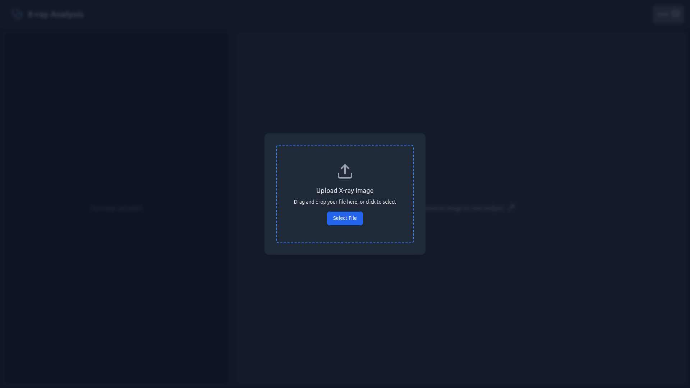
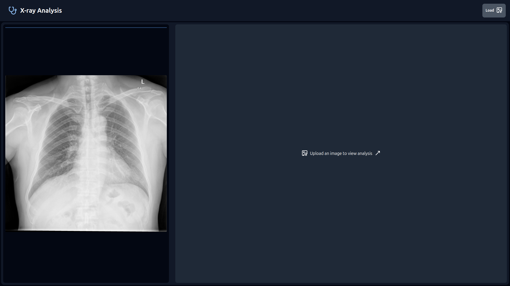
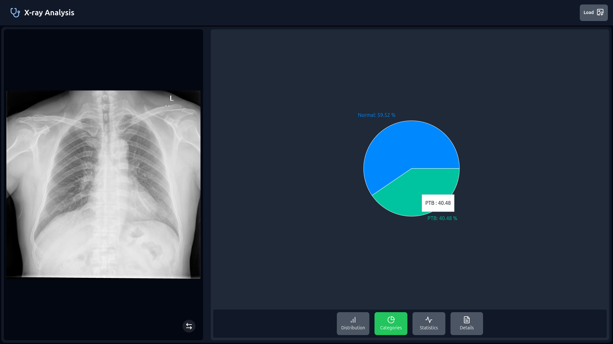

# TB-Detection-Segmentation-React-Flask

Tuberculosis Detection and Lung Segmentation A web application leveraging U-Net for automated tuberculosis detection and lung segmentation. The frontend is built with React, and the backend uses Flask for model integration and API handling. This tool aims to assist in early diagnosis and precise analysis of tuberculosis from medical images.

## Screenshots





---

## Getting Started

Follow these steps to set up and run the project:

---

### 1. Install Required Python Dependencies

```bash
pip install -r requirements.txt
```

---

### 2. Navigate to the Backend Directory and Run Flask Server

```bash
cd backend_TB/
flask --app tb_app run
```

- **`flask --app tb_app run`**: Starts the Flask development server using the `tb_app.py` application.

---

### 3. Navigate to the Frontend Directory and Install Dependencies

```bash
cd Front/
npm install
```

---

### 4. Start the React Frontend

```bash
npm run dev
```

---

### 5. Access the Application

Visit the URL shown in the terminal output (e.g., `http://localhost:5173/`) in your browser.
